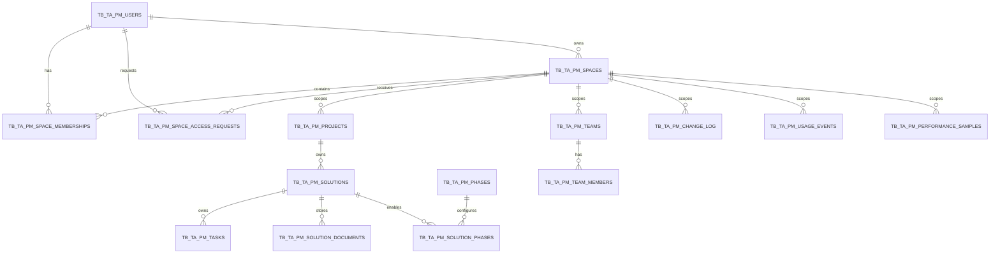
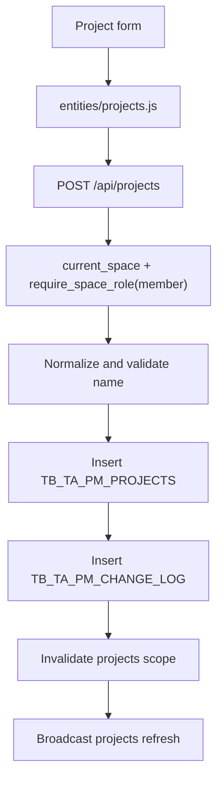
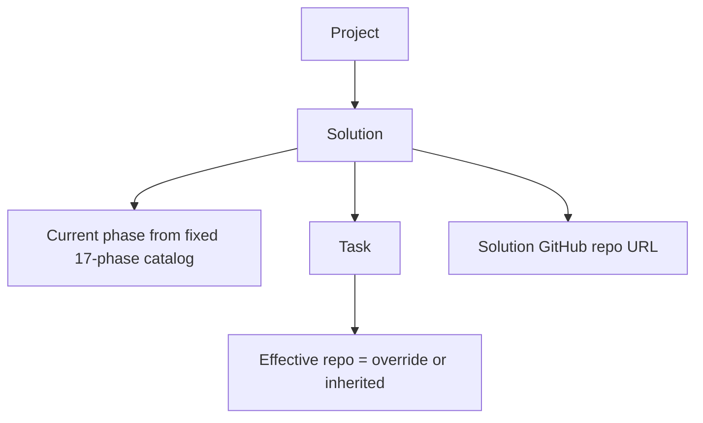
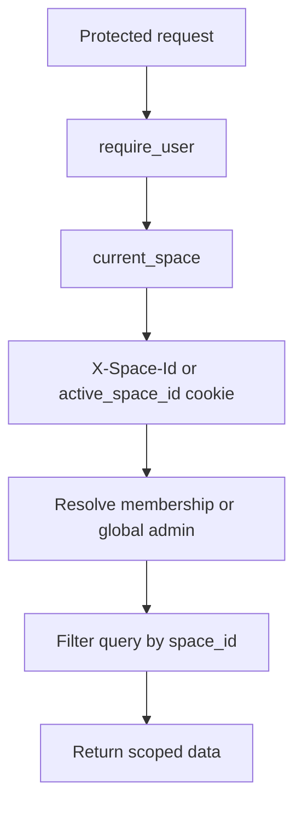

# SIPM Data Dictionary And Data Flow

This document defines the main persisted data entities, API-facing shapes, and application data flows for SIPM. The canonical physical database contract is `docs/sql/schema_oracle_ta.sql`; this document explains the meaning and ownership of that data.

## Naming And Storage Conventions

- Physical Oracle tables use the `TB_TA_PM_*` prefix.
- SQLAlchemy model table names are produced through `backend/app/db/table_names.py`.
- Most business tables include `created_at` and `updated_at`.
- Soft-deletable tables include `deleted_at`; normal queries filter these rows out.
- Most business data is scoped by `space_id`.
- Primary keys are string identifiers generated by the application unless the table is reference data.
- Date-only business fields use `DATE`; audit and runtime fields use datetime/timestamp-style values.

## Core Entity Relationship Map

## Business Domains

### Identity And Access

#### `TB_TA_PM_USERS`

SQLAlchemy model: `User`

Purpose: stores SIPM application users, authentication state, capacity defaults, and service-account flags.

Key fields:

| Field | Type | Meaning |
| --- | --- | --- |
| `user_id` | string PK | Internal user identifier. |
| `soeid` | string unique | Enterprise/user login identifier. |
| `email` | string unique | User email. |
| `display_name` | string | Human-readable name. |
| `password_hash` | string | Bcrypt hash for application-managed login. |
| `role` | string | Global application role, including global admin. |
| `is_active` | boolean | Whether user may authenticate and be assigned. |
| `is_service_account` | boolean | Whether admin-issued API tokens may be used for this user. |
| `team_tag` | string nullable | Display/team assignment used by team capacity administration. |
| `capacity_hours` | integer | Legacy weekly capacity value. |
| `capacity_fte_month` | float | Monthly FTE capacity used by team capacity administration. |
| `failed_attempts` | integer | Login lockout counter. |
| `locked_until` | datetime nullable | Lockout expiration. |
| `last_login_at` | datetime nullable | Last successful login. |
| `temp_password_hash` | string nullable | Admin-issued reset credential hash. |
| `temp_password_expires_at` | datetime nullable | Temp password expiration. |
| `force_password_reset` | boolean | Forces user through reset flow. |
| `password_changed_at` | datetime nullable | Used to revoke older tokens. |

Important constraints:

- Unique `email`.
- Unique `soeid`.

Used by:

- Auth routes.
- User admin routes.
- Space memberships.
- Work allocation people.
- Analytics identity rollups.

#### `TB_TA_PM_API_TOKENS`

SQLAlchemy model: `ApiToken`

Purpose: stores hashed personal access tokens for service-account automation.

Key fields:

| Field | Type | Meaning |
| --- | --- | --- |
| `token_id` | string PK | Internal token id. |
| `user_id` | FK users | Service-account user represented by the token. |
| `name` | string | Admin-facing token label. |
| `token_hash` | string unique | SHA/hash of token; raw token is returned only once. |
| `created_by_user_id` | string | Admin user that issued the token. |
| `last_used_at` | datetime nullable | Last successful bearer auth. |
| `expires_at` | datetime nullable | Optional expiration. |
| `revoked_at` | datetime nullable | Revocation marker. |

Data flow:

1. Admin creates token under `/api/users/{user_id}/api-tokens`.
2. Backend returns raw token once.
3. Automation sends `Authorization: Bearer <token>`.
4. `require_user()` calls `authenticate_api_token()`.
5. Token hash and status are validated.

#### `TB_TA_PM_SPACES`

SQLAlchemy model: `Space`

Purpose: top-level tenant/workspace boundary for SIPM data.

Key fields:

| Field | Type | Meaning |
| --- | --- | --- |
| `space_id` | string PK | Space identifier. |
| `name` | string unique | Display name. |
| `slug` | string unique | URL/API-friendly identifier. |
| `is_active` | boolean | Whether space can be used. |
| `space_kind` | string | `lobby`, `collaboration`, or `personal`. |
| `owner_user_id` | FK users nullable | Owner for a self-service personal space. |
| `archived_at` | datetime nullable | Archive marker. |
| `deleted_at` | datetime nullable | Soft-delete marker. |

Used by:

- Active space cookie/header.
- Space governance.
- All scoped business tables.

Important constraints:

- Unique `(owner_user_id, space_kind)` keeps each user to one personal space.
- The `home` slug is the shared lobby/Home space; existing `main` spaces remain collaboration spaces.
- `personal` spaces do not accept non-owner memberships in this version.

#### `TB_TA_PM_SPACE_MEMBERSHIPS`

SQLAlchemy model: `SpaceMembership`

Purpose: grants a user access to a space and defines their per-space role.

Key fields:

| Field | Type | Meaning |
| --- | --- | --- |
| `membership_id` | string PK | Membership identifier. |
| `space_id` | FK spaces | Space being joined. |
| `user_id` | FK users | User in the space. |
| `role` | string | `member` or `space_admin`. |
| `status` | string | `active` or inactive-like values. |
| `deleted_at` | datetime nullable | Soft-delete marker. |

Important constraints:

- Unique `(space_id, user_id)`.

Data flow:

1. User signs in.
2. `current_space()` resolves requested space from header/cookie.
3. `services.spaces.resolve_active_space_context()` verifies membership or global admin.
4. Route logic filters data by `space_id`.

#### `TB_TA_PM_SPACE_ACCESS_REQUESTS`

SQLAlchemy model: `SpaceAccessRequest`

Purpose: tracks self-service requests from lobby users into collaboration spaces.

Key fields:

| Field | Type | Meaning |
| --- | --- | --- |
| `request_id` | string PK | Request identifier. |
| `space_id` | FK spaces | Collaboration space being requested. |
| `requester_user_id` | FK users | User requesting access. |
| `requested_role` | string | Requested per-space role, normally `member`. |
| `status` | string | `pending`, `approved`, `rejected`, or `canceled`. |
| `decided_by_user_id` | FK users nullable | Admin who approved/rejected/canceled. |
| `decided_at` | datetime nullable | Decision timestamp. |
| `decision_note` | text nullable | Optional admin note. |

Data flow:

1. Lobby user requests an active `collaboration` space.
2. Duplicate pending requests return the existing request.
3. Space admin or global admin approves/rejects.
4. Approval creates or restores an active `SpaceMembership`.

### Portfolio Work

#### `TB_TA_PM_PROGRAMS`

SQLAlchemy model: `Program`

Purpose: umbrella portfolio grouping above projects.

Key fields:

| Field | Type | Meaning |
| --- | --- | --- |
| `program_id` | string PK | Program identifier. |
| `space_id` | FK spaces | Owning space. |
| `program_name` | string | Program display name. |
| `description` | text nullable | Program description. |
| `deleted_at` | datetime nullable | Soft-delete marker. |

Important constraints:

- Unique `(space_id, program_name)`.

Primary APIs:

- `GET /api/programs`
- `GET /api/programs/{program_id}`
- `POST /api/programs`
- `PATCH /api/programs/{program_id}`
- `DELETE /api/programs/{program_id}`

Special rules:

- Programs with active projects cannot be deleted.
- Existing projects are assigned to a per-space `Default Program` during migration.

#### `TB_TA_PM_PROJECTS`

SQLAlchemy model: `Project`

Purpose: portfolio initiative under a program.

Key fields:

| Field | Type | Meaning |
| --- | --- | --- |
| `project_id` | string PK | Project identifier. |
| `space_id` | FK spaces | Owning space. |
| `program_id` | FK programs | Parent program. |
| `project_name` | string | Project display name. |
| `status` | enum | Project lifecycle status. |
| `description` | text nullable | Project description. |
| `success_criteria` | text nullable | Completion or acceptance criteria. |
| `sponsor` | string | Sponsor display label. |
| `sponsor_user_soeid` | string nullable | Sponsor identity link. |
| `strategic_objective` | text nullable | Business objective. |
| `priority` | integer | Lower numbers sort higher priority. |
| `deleted_at` | datetime nullable | Soft-delete marker. |

Important constraints:

- Unique `(space_id, project_name)`.

Primary APIs:

- `GET /api/projects`
- `GET /api/projects/{project_id}`
- `POST /api/projects`
- `PATCH /api/projects/{project_id}`
- `DELETE /api/projects/{project_id}`
- `POST /api/projects/import`
- `GET /api/projects/export`

Data flow:

1. Frontend project form calls project entity controller.
2. Controller calls project API through `session.api()`.
3. Backend validates the selected program in the current space.
4. Backend validates project name uniqueness in the current space.
5. Backend writes `Project`.
6. Backend logs changes and broadcasts `projects`.

- Project import/export includes `program_id` and `program_name`; imports resolve by `program_id`, then `program_name`, then the default program when both are blank.
- Updating `Project.program_id` reassigns the project to another active program without changing child solution or task identifiers.

#### `TB_TA_PM_SOLUTIONS`

SQLAlchemy model: `Solution`

Purpose: deliverable or solution under a project.

Key fields:

| Field | Type | Meaning |
| --- | --- | --- |
| `solution_id` | string PK | Solution identifier. |
| `space_id` | FK spaces | Owning space. |
| `project_id` | FK projects | Parent project. |
| `solution_name` | string | Deliverable name. |
| `version` | string | Version label. |
| `status` | enum | Solution lifecycle status. |
| `rag_status` | enum | Red/amber/green health. |
| `rag_reason` | text nullable | RAG explanation. |
| `priority` | integer | Priority ranking. |
| `due_date` | date nullable | Target date. |
| `planned_start_date` | date nullable | Planned start date. |
| `current_phase` | string nullable | Current canonical phase id; blank means unassigned. |
| `description` | text nullable | Description. |
| `success_criteria` | text nullable | Completion criteria. |
| `problem_statement` | text nullable | Problem statement. |
| `github_repo_url` | string nullable | Repository URL. |
| `owner` | string | Owner display label. |
| `owner_user_soeid` | string nullable | Owner identity link. |
| `assignee` | string | Assignee display label. |
| `assignee_user_soeid` | string nullable | Assignee identity link. |
| `approver` | string nullable | Approver display label. |
| `approver_user_soeid` | string nullable | Approver identity link. |
| `key_stakeholder` | string nullable | Stakeholder label. |
| `blockers` | text nullable | Blocker notes. |
| `risks` | text nullable | Risk notes. |
| `impact_confidence` | enum nullable | Confidence indicator. |
| `rag_confidence` | float nullable | Numeric RAG confidence. |
| `completed_at` | datetime nullable | Completion timestamp. |
| `capacity_hours` | integer | Effort/capacity value. |
| `deleted_at` | datetime nullable | Soft-delete marker. |

Important constraints:

- Unique `(project_id, solution_name, version)`.

Primary APIs:

- `GET /api/solutions`
- `GET /api/projects/{project_id}/solutions`
- `GET /api/solutions/{solution_id}`
- `POST /api/projects/{project_id}/solutions`
- `PATCH /api/solutions/{solution_id}`
- `DELETE /api/solutions/{solution_id}`
- `GET /api/solutions/{solution_id}/documents`
- `POST /api/solutions/{solution_id}/documents`
- `GET /api/solutions/{solution_id}/documents/{document_id}/download`
- `DELETE /api/solutions/{solution_id}/documents/{document_id}`
- `POST /api/solutions/import`
- `GET /api/solutions/export`

Special rules:

- Tasks inherit an effective GitHub repo URL from their parent solution unless overridden.
- Documents are stored as DB-backed attachments under the solution and are downloaded individually.

#### `TB_TA_PM_SOLUTION_DOCUMENTS`

SQLAlchemy model: `SolutionDocument`

Purpose: stores binary documents attached to a solution.

Key fields:

| Field | Type | Meaning |
| --- | --- | --- |
| `document_id` | string PK | Document identifier. |
| `space_id` | FK spaces | Owning space. |
| `solution_id` | FK solutions | Parent solution. |
| `filename` | string | Original uploaded filename. |
| `content_type` | string nullable | Uploaded media type. |
| `size_bytes` | integer | File size in bytes. |
| `content` | BLOB | Raw file bytes. |
| `uploaded_by_user_id` | string | User that uploaded the document. |
| `deleted_at` | datetime nullable | Soft-delete marker. |

Primary APIs:

- `GET /api/solutions/{solution_id}/documents`
- `POST /api/solutions/{solution_id}/documents`
- `GET /api/solutions/{solution_id}/documents/{document_id}/download`
- `DELETE /api/solutions/{solution_id}/documents/{document_id}`

Special rules:

- Uploads allow any file type up to 25 MB.
- Normal solution list/detail payloads include no document bytes or document metadata.
- CSV solution import/export does not include documents.

#### `TB_TA_PM_TASKS`

SQLAlchemy model: `Task`

Purpose: execution-level work item under a solution.

Key fields:

| Field | Type | Meaning |
| --- | --- | --- |
| `task_id` | string PK | Task identifier. |
| `space_id` | FK spaces | Owning space. |
| `project_id` | FK projects | Parent project. |
| `solution_id` | FK solutions | Parent solution. |
| `task_name` | string | Work item name. |
| `description` | text nullable | Context and scope for the task. |
| `status` | enum | Work lifecycle status. |
| `priority` | integer | Priority ranking. |
| `due_date` | date nullable | Target date. |
| `completed_at` | datetime nullable | Completion timestamp. |
| `assignee_user_soeid` | string nullable | Assignee identity link. |
| `assignee` | string | Assignee display label. |
| `github_repo_url` | string nullable | Task repository override. |
| `estimate_hours` | integer nullable | Estimated effort. |
| `blocked` | boolean | Blocked flag. |
| `blocker_note` | text nullable | Blocker explanation. |
| `done_criteria` | text nullable | Physical storage for product-facing acceptance criteria. The API also returns this legacy alias for compatibility. |
| `capacity_hours` | integer | Capacity/effort value used for FTE conversion. |
| `deleted_at` | datetime nullable | Soft-delete marker. |

Important constraints:

- Unique `(solution_id, task_name)`.

Primary APIs:

- `GET /api/tasks`
- `GET /api/solutions/{solution_id}/tasks`
- `GET /api/tasks/{task_id}`
- `GET /api/tasks/{task_id}/activity`
- `POST /api/solutions/{solution_id}/tasks`
- `PATCH /api/tasks/{task_id}`
- `PATCH /api/tasks/actions/batch`
- `DELETE /api/tasks/{task_id}`
- `POST /api/tasks/import`
- `GET /api/tasks/export`

Derived API fields:

- `acceptance_criteria`: preferred product/API name for the value stored in `done_criteria`.
- `effective_github_repo_url`: override repo or inherited solution repo.
- `repo_source`: `override`, `inherited`, or `none`.
- `is_overdue`, `is_due_soon`, `is_stale`, `urgency_score`: route payload-derived indicators.

### Phase Reference Data

#### `TB_TA_PM_PHASES`

SQLAlchemy model: `Phase`

Purpose: fixed reference table for the 17 allowed solution phases.

Canonical order:

1. `backlog` — Backlog
2. `requirements` — Requirements
3. `controls_scoping` — Controls & Scoping
4. `resourcing_timeline` — Resourcing & Timeline
5. `poc` — Proof of Concept
6. `delivery_success` — Delivery and Success Criteria
7. `design` — Design
8. `build_docs` — Build & Documentation
9. `sandbox_deploy` — Sandbox Deployment
10. `socialization_signoff` — Socialization & Signoff
11. `deployment_prep` — Deployment Preparation
12. `dev_deploy` — DEV Deployment
13. `uat_deploy` — UAT Deployment
14. `prod_deploy` — PROD Deployment
15. `go_live` — Go Live
16. `closure_signoff` — Closure and Signoff
17. `handoff_offboarding` — Handoff and offboarding

Key fields:

| Field | Type | Meaning |
| --- | --- | --- |
| `phase_id` | string PK | Stable phase id. |
| `phase_group` | string | Lifecycle grouping used to organize the canonical catalog. |
| `phase_name` | string | Display label. |
| `sequence` | integer | Default ordering. |

Primary APIs:

- `GET /api/phases`
- `GET /api/solutions/{solution_id}/phases`
- `POST /api/solutions/{solution_id}/phases` (legacy API compatibility; not exposed in the UI)

#### `TB_TA_PM_SOLUTION_PHASES`

SQLAlchemy model: `SolutionPhase`

Purpose: compatibility link between solutions and phase reference rows. The canonical migration
enables all 17 phases with default ordering for every solution; the solution editor does not
expose per-solution phase configuration.

Key fields:

| Field | Type | Meaning |
| --- | --- | --- |
| `solution_phase_id` | string PK | Link identifier. |
| `solution_id` | FK solutions | Solution being configured. |
| `phase_id` | FK phases | Phase reference. |
| `is_enabled` | boolean | Whether the phase is active for that solution. |
| `sequence_override` | integer nullable | Optional solution-specific ordering. |

Important constraints:

- Unique `(solution_id, phase_id)`.

### Team Capacity

#### `TB_TA_PM_TEAMS`

SQLAlchemy model: `Team`

Purpose: team groupings for capacity and assignment.

Key fields:

| Field | Type | Meaning |
| --- | --- | --- |
| `team_id` | string PK | Team identifier. |
| `space_id` | FK spaces | Owning space. |
| `name` | string | Team display name. |
| `description` | string nullable | Team description. |
| `lead` | string nullable | Team lead label. |
| `default_capacity_per_week` | integer | Legacy weekly capacity. |
| `default_capacity_fte_month` | float | Default monthly FTE capacity. |
| `capacity_unit` | string | Capacity unit label, normally `fte_month`. |
| `deleted_at` | datetime nullable | Soft-delete marker. |

Important constraints:

- Unique `(space_id, name)`.

Primary APIs:

- `GET/POST/PATCH/DELETE /api/teams`

#### `TB_TA_PM_TEAM_MEMBERS`

SQLAlchemy model: `TeamMember`

Purpose: legacy explicit member rows under a team.

Key fields:

| Field | Type | Meaning |
| --- | --- | --- |
| `team_member_id` | string PK | Member row id. |
| `space_id` | FK spaces | Owning space. |
| `team_id` | FK teams | Parent team. |
| `member_name` | string | Member display name. |
| `role` | string | Role label. |
| `capacity_override` | integer nullable | Generic override. |
| `capacity_unit` | string nullable | Override unit. |
| `hours_capacity` | integer nullable | Hours capacity. |
| `capacity_fte_month` | float nullable | FTE-month capacity. |
| `points_capacity` | integer nullable | Points capacity. |
| `percent_capacity` | float nullable | Percent capacity. |
| `deleted_at` | datetime nullable | Soft-delete marker. |

Primary APIs:

- `GET/POST/PATCH/DELETE /api/teams/{team_id}/members`

### Audit And Observability

#### `TB_TA_PM_CHANGE_LOG`

SQLAlchemy model: `ChangeLog`

Purpose: field-level audit trail for user-visible mutations and authorization denials.

Key fields:

| Field | Type | Meaning |
| --- | --- | --- |
| `change_id` | string PK | Change record id. |
| `entity_type` | string | Entity category, such as `project`, `solution`, `task`, `authz`. |
| `entity_id` | string | Entity identifier. |
| `action` | string | Action, such as `create`, `update`, `delete`, or forbidden action. |
| `field` | string nullable | Field changed. |
| `old_value` | text nullable | Previous value. |
| `new_value` | text nullable | New value. |
| `user_id` | string | Actor user id. |
| `space_id` | FK spaces nullable | Space context. |
| `request_id` | string nullable | Request correlation id. |
| `created_at` | datetime | Change timestamp. |

Primary API:

- `GET /api/audit`

Data flow:

1. Mutating route builds before/after field set.
2. Route calls `safe_log_changes()` or `log_changes()`.
3. Change rows inherit request id from request context where available.

#### `TB_TA_PM_USAGE_EVENTS`

SQLAlchemy model: `UsageEvent`

Purpose: raw product usage and workflow telemetry.

Key fields:

| Field | Type | Meaning |
| --- | --- | --- |
| `event_id` | string PK | Event id. |
| `occurred_at` | datetime | Browser event time. |
| `received_at` | datetime | Server ingest time. |
| `session_id` | string | Per-tab session id. |
| `user_id` | string | Authenticated user id. |
| `space_id` | FK spaces nullable | Active space. |
| `view_key` | string | Current frontend view. |
| `category` | string | `navigation`, `workflow`, `operations`, etc. |
| `feature_key` | string | Feature identifier. |
| `action_key` | string | Action identifier. |
| `outcome` | string | `success`, `failure`, `timeout`, etc. |
| `duration_ms` | integer nullable | Duration. |
| `status_code` | integer nullable | HTTP-like status where relevant. |
| `details_json` | text nullable | JSON details payload. |

Primary API:

- `POST /api/analytics/ingest`

#### `TB_TA_PM_PERFORMANCE_SAMPLES`

SQLAlchemy model: `PerformanceSample`

Purpose: browser navigation, route transition, and Web Vitals-like timing samples.

Key fields:

| Field | Type | Meaning |
| --- | --- | --- |
| `sample_id` | string PK | Sample id. |
| `occurred_at` | datetime | Browser sample time. |
| `received_at` | datetime | Server ingest time. |
| `session_id` | string | Per-tab session id. |
| `user_id` | string | Authenticated user id. |
| `space_id` | FK spaces nullable | Active space. |
| `view_key` | string | Current frontend view. |
| `sample_kind` | string | `navigation` or `route_transition`. |
| `navigation_type` | string nullable | Browser navigation type. |
| `data_load_ms` | integer nullable | Route data-load time. |
| `render_ms` | integer nullable | Route render time. |
| `ttfb_ms` | integer nullable | Time to first byte. |
| `dom_interactive_ms` | integer nullable | DOM interactive time. |
| `dom_content_loaded_ms` | integer nullable | DOM content loaded time. |
| `load_event_ms` | integer nullable | Load event time. |
| `first_paint_ms` | integer nullable | First paint. |
| `first_contentful_paint_ms` | integer nullable | First contentful paint. |
| `largest_contentful_paint_ms` | integer nullable | Largest contentful paint. |
| `cls_score` | float nullable | Cumulative layout shift. |
| `long_task_count` | integer nullable | Long task count. |
| `long_task_total_ms` | integer nullable | Total long task duration. |

#### Analytics Rollup Tables

`TB_TA_PM_USAGE_DAILY_ROLLUPS`

- Aggregates event counts by date, space, view, category, feature, action, and outcome.
- Primary key: `(rollup_date, space_id, view_key, category, feature_key, action_key, outcome)`.

`TB_TA_PM_USAGE_IDENTITY_DAILY_ROLLUPS`

- Tracks unique tokenized identities by date/space/token type.
- Primary key: `(rollup_date, space_id, token_type, token_value)`.

`TB_TA_PM_USAGE_ROUTE_IDENTITY_DAILY_ROLLUPS`

- Tracks unique tokenized identities by date/space/route/token type.
- Primary key: `(rollup_date, space_id, view_key, token_type, token_value)`.

Primary read APIs:

- `GET /api/analytics/summary`
- `GET /api/analytics/routes`
- `GET /api/analytics/performance`
- `GET /api/analytics/dashboard`

## API-Facing Data Shapes

### Analytics Ingest

`TelemetryBatchIn`:

| Field | Meaning |
| --- | --- |
| `events` | List of `UsageEventIn`. |
| `performance_samples` | List of `PerformanceSampleIn`. |

String token fields are normalized to lowercase snake-like values by schema validators.

## End-To-End Data Flows

### Project Creation

### Solution And Task Flow

### Space Isolation Flow

## Data Quality And Integrity Rules

- Project names are unique within a space.
- Team names are unique within a space.
- Solution names are unique by project and version.
- Task names are unique within a solution.
- Space membership is unique by `(space_id, user_id)`.
- Soft-deleted entities are normally excluded from reads.
- User deactivation is guarded when the user cannot safely be deactivated.
- Auth tokens issued before `password_changed_at` are rejected.

## Frontend Data Cache

The frontend stores fetched entity arrays in memory:

| State field | Source API | Used by |
| --- | --- | --- |
| `state.phases` | `/api/phases` | master, Kanban, current-phase selector |
| `state.programs` | `/api/programs` | project forms, project filters, hierarchy labels |
| `state.projects` | `/api/projects` | master, dashboards, Gantt |
| `state.solutions` | `/api/solutions` | master, dashboards, Gantt, Kanban, Calendar |
| `state.tasks` | `/api/tasks` | workbench, PM dashboard |
| `state.teams` | `/api/teams` | team capacity |
| `state.users` | `/api/users` | assignment selectors, governance, dashboards |

`state.loadedEntities` prevents repeat fetches. Live sync, explicit reloads, and mutations can force a reload.

## Retention And Operational Notes

- Raw analytics events are intended for short-lived operational insight.
- The README specifies external purge of raw analytics rows older than 90 days.
- SIPM does not currently include an in-app retention scheduler.
- Database schema changes must be applied externally from the canonical SQL.
- Readiness verifies DB connectivity unless startup DB checks are disabled.
