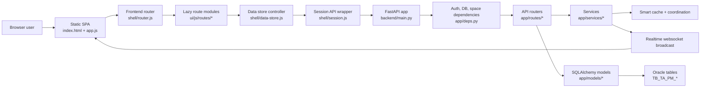
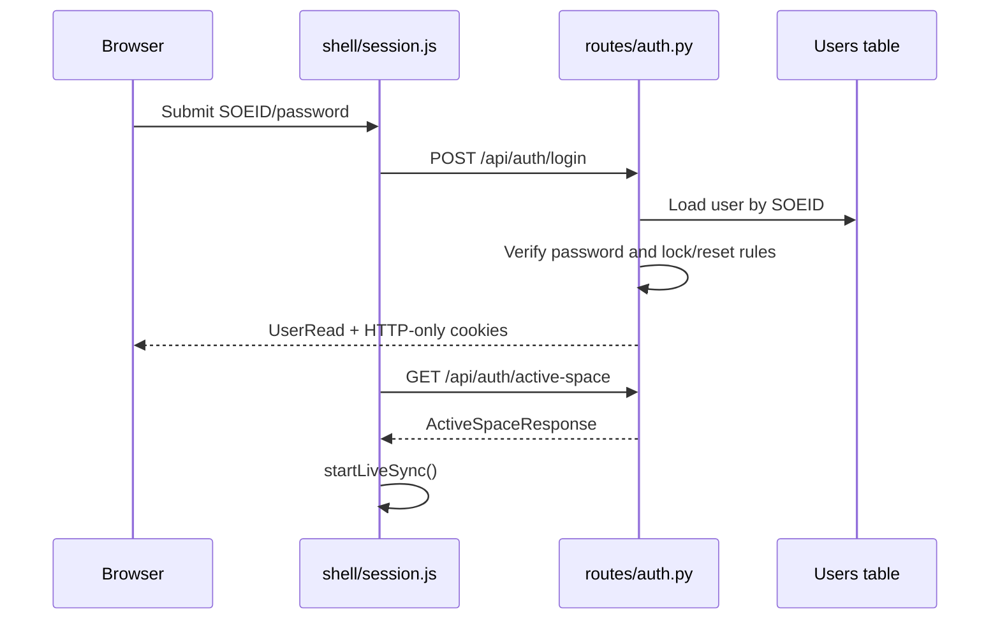
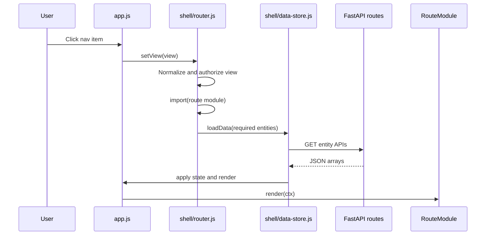
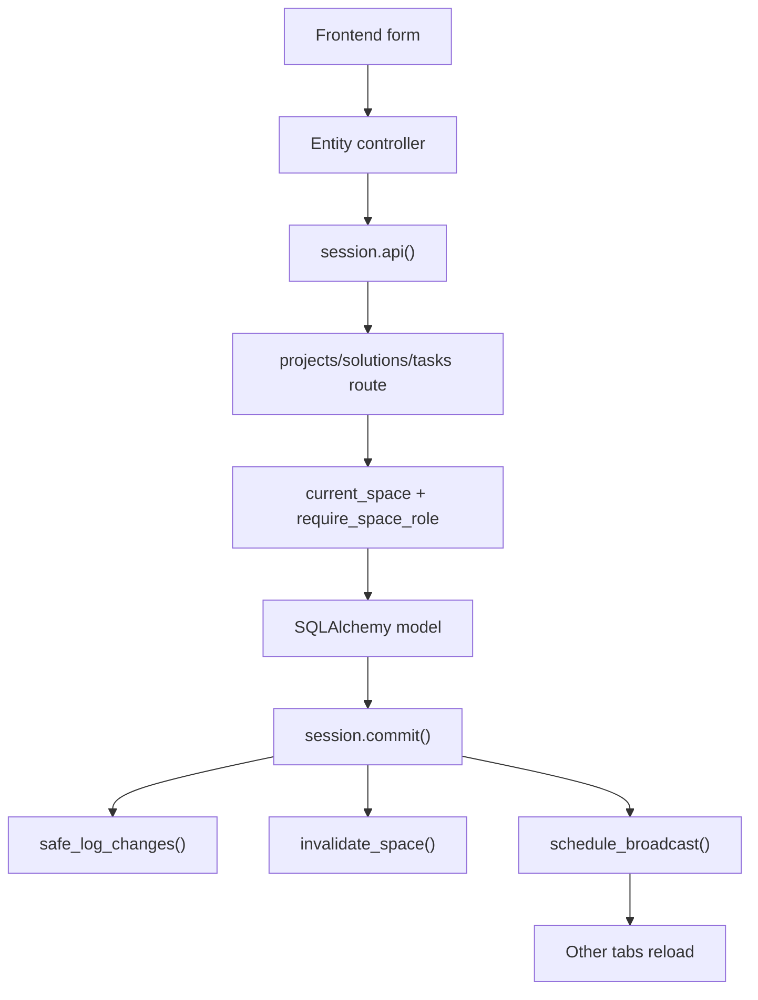
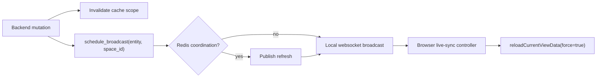

# SIPM Technical Architecture And Code Flow

This document is the standard technical handoff for SIPM. It describes how the application is structured, how user requests move through the frontend and backend, why the form and module boundaries exist, and what each major module calls.

## Scope

SIPM is a FastAPI application with a vanilla ES module frontend. The backend serves both JSON APIs and the static single-page application from the same process. The canonical runtime entry point is `backend.main:app` under `src/main`.

Primary source locations:

- Backend entry point: `src/main/backend/main.py`
- Backend application package: `src/main/backend/app`
- Frontend shell: `src/main/ui/js/app.js`
- Frontend shell controllers: `src/main/ui/js/shell`
- Frontend route modules: `src/main/ui/js/routes`
- Frontend entity controllers: `src/main/ui/js/entities`
- Canonical Oracle schema: `docs/sql/schema_oracle_ta.sql`
- Runtime and operations notes: `src/main/README.md`

## Runtime Stack

Backend:

- FastAPI provides HTTP routing, dependency injection, OpenAPI, and WebSocket support.
- SQLAlchemy maps application models to Oracle table contracts.
- `oracledb` is used by the production database engine through TAConnection.
- PyJWT and passlib/bcrypt support application-managed authentication.
- Redis is optional and is used for cross-instance coordination when configured.

Frontend:

- Vanilla JavaScript ES modules.
- Static HTML/CSS served by FastAPI.
- Dynamic route modules loaded with `import()`.
- Browser `fetch` for HTTP calls and `WebSocket` for live refresh events.
- Local/session storage for user-scoped and space-scoped UI preferences.

Testing and tooling:

- `pytest` covers backend contracts and route behavior.
- Vitest/jsdom covers frontend units.
- Playwright covers browser smoke flows.
- ESLint checks frontend source.

## High-Level Architecture

The application uses one backend process as the gateway for app pages, API requests, readiness checks, and WebSockets. The frontend stays framework-light but is organized around controllers so route behavior and data loading do not live entirely in one file.

## Application Startup

Startup begins in `src/main/backend/main.py`. The canonical ASGI target is the module-level `backend.main:app`.

Call flow:

1. `backend.main` loads the repo environment and runtime path constants.
2. `app = FastAPI(title="SIPM API", version="0.1.0", lifespan=lifespan, ...)` is constructed at module import time.
3. API routers are included under `API_PREFIX`, which defaults to `/project-manager/api`.
4. Request observability/security middleware is registered in `main.py`.
5. Health/readiness routes are registered in `main.py`.
6. Frontend static and SPA catch-all routes are registered in `main.py`.

Lifespan flow in `backend/main.py`:

1. `validate_auth_configuration()` enforces authentication/runtime safety.
2. `coordination.validate_configuration()` verifies `memory` or `redis` coordination settings.
3. `start_realtime_runtime()` starts Redis refresh listeners when Redis coordination is enabled.
4. Unless `SIPM_DISABLE_STARTUP=true`, `init_db()` initializes the SQLAlchemy session factory.
5. Optional pool prewarming runs if `SIPM_DB_PREWARM_ON_STARTUP=true`.
6. Optional keepwarm checks run on `SIPM_DB_KEEPWARM_INTERVAL_SECONDS`.
7. Shutdown stops realtime runtime and cancels background tasks.

Design choice: startup validates runtime readiness but intentionally does not mutate production database schema. The canonical schema lives in `docs/sql/schema_oracle_ta.sql`, and schema deployment is an external platform/DBA responsibility.

## Path And Context Routing

`backend/app/paths.py` centralizes app paths:

- `SIPM_CONTEXT_PATH` defaults to `/project-manager`.
- `API_PREFIX` defaults to `/project-manager/api`.
- OpenAPI/docs paths are context-scoped.
- Cookie path follows the app context.

The frontend computes its context path from `import.meta.url` in `src/main/ui/js/shell/paths.js`, so the same frontend bundle works under the configured application context. Frontend API calls use `API_BASE`, and WebSockets use `buildWsUrl()`.

Design choice: context path logic is centralized because this app is intended to be deployed behind an enterprise ingress path, not necessarily at `/`.

## Frontend Request Lifecycle

Initial page load:

1. Browser requests `/project-manager/`.
2. The frontend routes in `backend/main.py` serve `src/main/ui/index.html`.
3. `index.html` loads `src/main/ui/js/app.js`.
4. `app.js` queries DOM handles through `queryShellElements()`.
5. Controllers are created in `initShellControllers()`.
6. `init()` binds UI events and calls `sessionController.bootstrapAuth()`.
7. The router selects the initial view from the URL path.

Authenticated view load:

1. User clicks a navigation button or directly opens a route path.
2. `bindNav()` calls `setView(view)`.
3. `app.js` delegates to `routerController.setView()`.
4. `shell/router.js` normalizes the requested view and enforces role access.
5. The router lazy-loads the route module from `ui/js/routes`.
6. The router asks `dataStoreController.loadData()` for the entities required by that view.
7. `data-store.js` fetches entity collections through the `api()` wrapper.
8. Loaded arrays are placed into shared `state`.
9. `renderActiveView()` calls the route render function.
10. Telemetry records route transition timing when usage analytics is enabled.

Mutation flow from a form:

1. A user submits a project, solution, task, team, or admin form.
2. The relevant entity controller or route interaction module builds the payload.
3. The controller calls `api(path, { method, body })`.
4. `shell/session.js` attaches credentials and `X-Space-Id`.
5. On success, the local state is updated or a refresh is requested.
6. Backend mutation helpers invalidate cache scope tokens and schedule live refresh events.
7. Other open tabs receive a WebSocket `refresh` message and reload current view data.

## Frontend Module Map

### Shell Entrypoint

`src/main/ui/js/app.js` is the composition root. It owns shared state, creates controllers, exposes helper functions, and wires rendering callbacks together.

Important responsibilities:

- Holds the central `state` object.
- Creates entity controllers for projects, solutions, and tasks.
- Creates route controllers for calendar, Gantt, Kanban, team capacity, and space governance.
- Creates shell controllers for router, data store, session, telemetry, live sync, modal shell, space switcher, and topbar create menu.
- Provides shared render helpers and common data transformation utilities.

Design choice: `app.js` remains the integration surface because the app is a no-framework SPA. New isolated behavior is moved into controller modules, while cross-route orchestration remains centralized.

### Shell Controllers

`shell/router.js`

- Defines known views.
- Maps views to required data entities.
- Controls lazy route module loading.
- Enforces admin/global-admin view access.
- Syncs browser history with app views.

`shell/data-store.js`

- Fetches entity data: phases, projects, solutions, tasks, teams, and users.
- Caches loaded entity names in `state.loadedEntities`.
- Prevents duplicate simultaneous loads.
- Handles refresh coalescing.
- Schedules adjacent-view prefetches.

`shell/session.js`

- Owns login, register, logout, reset-password UI flows.
- Wraps `fetch` in `api()`.
- Adds cookies and `X-Space-Id`.
- Handles request timeouts.
- Refreshes access tokens on eligible 401 responses.
- Clears local session state on terminal auth failures.

`shell/live-sync.js`

- Opens `/api/ws` after authentication and active space selection.
- Sends periodic ping messages.
- Responds to refresh messages by reloading current view data.
- Recovers from auth and space close codes.
- Pauses when the document is hidden.

`shell/telemetry.js`

- Creates a per-tab session id.
- Queues workflow, navigation, API failure, and performance events.
- Flushes batches to `/api/analytics/ingest`.
- Uses `sendBeacon` on page lifecycle events when possible.

`shell/dom.js`

- Collects all required DOM elements once and returns named references.
- Keeps selectors in one place so route and entity code can receive handles through context.

`shell/context.js`

- Creates route contexts by merging the base context with route-specific overrides.

`shell/paths.js`

- Computes app context path, API base, WebSocket URL, reset password URL, and asset versioning.

### Entity Controllers

`entities/projects.js`

- Binds project form interactions.
- Creates, updates, and deletes project records through `/projects`.
- Updates local state and dependent views.

`entities/solutions.js`

- Binds solution modal/form interactions.
- Creates, updates, and deletes solutions.
- Manages the current-phase selector and task modal state.
- Tracks workflow telemetry.

`entities/tasks.js`

- Binds task form interactions.
- Creates, updates, deletes, and updates task-related UI state.
- Resolves assignee and capacity conversions.

Design choice: the project/solution/task split matches the business hierarchy and keeps write behavior near the entity it mutates.

### User Experience Route Modules

The router exposes these user-facing modules:

| UX module | Route/view | Main files | Primary data |
| --- | --- | --- | --- |
| Master | `/` / `master` | `routes/master.js`, `routes/master/*` | phases, projects, solutions |
| Gantt | `/gantt` | `routes/gantt.js`, `routes/gantt/interactions.js` | projects, solutions, tasks |
| Tasks Workbench | `/tasks-workbench` | `routes/tasks-workbench.js`, `routes/tasks-workbench/*` | projects, solutions, tasks, users |
| Dashboard | `/dashboard` | `routes/dashboard.js`, `routes/dashboard/*` | projects, solutions, users |
| PM Dashboard | `/pm-dashboard` | `routes/pm-dashboard.js`, `routes/pm-dashboard/*` | projects, solutions, tasks, users |
| Kanban | `/kanban` | `routes/kanban.js`, `routes/kanban/interactions.js` | phases, projects, solutions |
| Calendar | `/calendar` | `routes/calendar.js`, `routes/calendar/interactions.js` | projects, solutions |
| Team Capacity | `/team-capacity` | `routes/team-capacity.js`, `routes/team-capacity/interactions.js` | users, teams |
| Space Governance | `/spaces` and `/access` | `routes/spaces.js`, `routes/access.js`, `routes/spaces/*` | users, spaces, memberships |
| Analytics | `/analytics` | `routes/analytics.js` | analytics API payloads |

The route modules are deliberately display-oriented. Most shared data fetching is handled by `data-store.js`, and most write behavior is delegated to entity controllers or route interaction modules.

The Kanban route supports optimistic solution drag-and-drop between phase columns. A drop
updates `current_phase` through `PATCH /solutions/{solution_id}`; the card is restored to its
original phase and an error is shown if persistence fails. Drops remain within the solution's
project swimlane, so changing phase never reassigns the solution to another project.

### Frontend Call Matrix

| Caller | Calls | Purpose |
| --- | --- | --- |
| `app.js:init()` | `initShellControllers()`, bind functions, `bootstrapAuth()`, `setView()` | Bootstraps the SPA, binds events, and restores auth/view state. |
| `app.js:initShellControllers()` | `createRouterController()`, `createDataStoreController()`, `createSessionController()`, `createLiveSyncController()`, `createTelemetryController()` | Creates the orchestration layer. |
| `bindNav()` | `routerController.setView()` | Moves between UX modules and browser paths. |
| `routerController.setView()` | `ensureRouteModule()`, `loadData()` or `loadTeamCapacityData()` | Authorizes a view, loads route code, and requests data. |
| `dataStoreController.loadData()` | `fetchEntityData()`, `api()` | Loads required entity collections for the active view. |
| `sessionController.api()` | browser `fetch` | Sends authenticated JSON/form requests with cookies and `X-Space-Id`. |
| Entity controllers | `api()`, local state helpers, render helpers | Perform create/update/delete actions for projects, solutions, and tasks. |
| Route interaction modules | route render functions, `api()`, local state helpers | Bind route-specific filters, controls, drag/drop, saved views, and drilldowns. |
| `liveSyncController` | `WebSocket`, `reloadCurrentViewData()` | Keeps open tabs synchronized after backend mutations. |
| `telemetryController` | `/api/analytics/ingest` | Sends route, workflow, failure, and performance telemetry. |

## Backend Request Lifecycle

Protected API request flow:

1. Request enters FastAPI under `/project-manager/api`.
2. `request_observability_middleware()` assigns or preserves `X-Request-ID`.
3. Router dependencies run.
4. `require_user()` authenticates either:
   - `Authorization: Bearer <api_token>` for service accounts, or
   - `access_token` HTTP-only cookie for browser users.
5. `current_space()` resolves active space from `X-Space-Id` or `active_space_id` cookie.
6. Route function validates request with Pydantic schemas.
7. Route queries or mutates SQLAlchemy models.
8. Mutations log audit rows when applicable.
9. Mutations invalidate cache scope tokens and schedule live refresh.
10. Middleware adds security headers, no-store API cache headers, and `X-Request-ID`.

Design choice: browser auth is cookie-backed to avoid exposing reusable tokens to JavaScript. Service-account API tokens are accepted only through `Authorization: Bearer`, not query strings.

## Backend Module Map

### App Composition

`backend/main.py`

- Exposes the module-level `app` used by `uvicorn backend.main:app`.
- Owns startup/shutdown validation and runtime background tasks through its `lifespan()` handler.
- Includes API routers under the configured context path.
- Adds request correlation, compact JSON request logs, CSP/referrer/permissions headers, and API no-cache behavior.
- Registers `/health` and `/health/ready`; readiness checks auth configuration, coordination, frontend bundle presence, and DB connectivity.
- Serves static assets and `index.html` for SPA routes, returning `503` if required frontend files are missing.

### Dependencies And Security

`backend/app/deps.py`

- `get_db()` yields SQLAlchemy sessions.
- `require_user()` authenticates cookie users or service-account bearer tokens.
- `current_space()` resolves and validates active space.
- `require_global_admin()` gates global admin endpoints.
- `require_space_role(min_role)` gates member/space-admin operations.

`backend/app/auth/auth.py`

- Password hashing and JWT minting/decoding.
- Login, refresh, temp-password, and reset-password security rules.

`backend/app/security.py`

- Normalized security exceptions and error codes.

### Database

`backend/app/db/engine.py`

- Builds SQLAlchemy engine.
- Uses TAConnection creator for Oracle connectivity.

`backend/app/db/session.py`

- Initializes session factory.
- Provides `get_session()`.
- Performs readiness and pool warmup checks.

`backend/app/db/table_names.py`

- Maps logical model names to physical Oracle `TB_TA_PM_*` tables.
- Builds foreign-key target strings.

### Models

`backend/app/models/identity.py`

- Users, API tokens, spaces, memberships, change log, teams, team members.

`backend/app/models/work.py`

- Projects, solutions, phases, solution phases, and tasks.

`backend/app/models/analytics.py`

- Usage events, performance samples, and daily rollup tables.

### Schemas

`backend/app/schemas/__init__.py`

- Core read/create/update schemas for users, spaces, projects, solutions, tasks, and teams.

`backend/app/schemas/analytics.py`

- Telemetry ingest and analytics dashboard response schemas.

### Routes

`backend/app/routes/__init__.py`

- Includes `/auth` separately.
- Wraps most API routers in `Depends(require_user)`.
- Includes sync routes separately because WebSocket auth is handled inside the websocket handler.

Major route groups:

- `auth.py`: register, login, refresh, password reset, logout, current user, active space switching.
- `projects/*`: project CRUD and CSV import/export.
- `solutions/*`: solution CRUD, current-phase validation, CSV import/export.
- `tasks/*`: task CRUD, batch actions, activity, CSV import/export.
- `teams.py`: teams and team members.
- `users.py`: user directory, global admins, admin password reset, API tokens, import/export.
- `spaces.py`: spaces and space memberships.
- `phases.py`: fixed seven-phase reference data and legacy solution-phase API compatibility.
- `analytics.py`: telemetry ingest and analytics dashboard APIs.
- `audit.py`: change log reads.
- `sync.py`: realtime status and WebSocket endpoint.

### Services

`services/audit_log.py`

- Writes field-level change log records.
- Used by project, solution, task, user, and authorization paths.

`services/smart_cache.py`

- In-memory response caching with scope version tokens.
- Cache keys include endpoint, parameters, space, user, role scope, and scope versions.

`services/coordination.py`

- Memory or Redis-backed coordination.
- Redis mode shares cache invalidation and refresh fanout across instances.

`services/realtime.py`

- Tracks local WebSocket connections.
- Enforces global/per-user connection limits.
- Broadcasts refresh messages locally or through Redis coordination.

`services/spaces.py`

- Resolves active space context and role.
- Determines global admin and space-level access.

`services/usage_analytics.py`

- Validates telemetry.
- Builds summary, route, performance, and full dashboard payloads.

### Backend Call Matrix

| Caller | Calls | Purpose |
| --- | --- | --- |
| `backend.main:app` | `include_router()`, middleware decorators, health routes, frontend routes | Exposes the complete FastAPI application. |
| `backend.main:lifespan()` | auth validation, coordination validation, realtime startup, DB initialization | Prepares runtime dependencies before serving requests. |
| `routes/__init__.py` | individual route modules | Creates the protected API surface under `/api`. |
| Protected routers | `require_user()` | Reject unauthenticated requests before route logic runs. |
| Route functions | `get_db()`, `current_space()`, `require_space_role()` | Obtain DB session, tenant scope, and authorization. |
| Read routes | `cached_call()`, model query helpers, payload helpers | Return scoped and optionally cached payloads. |
| Write routes | SQLAlchemy models, audit services, mutation helpers | Validate, persist, audit, invalidate cache, and publish refresh events. |
| Mutation helpers | `invalidate_space()`, `schedule_broadcast()` | Keep cached API responses and open browser tabs current. |
| WebSocket route | `realtime.register()`, `heartbeat()`, `unregister()` | Tracks browser live-sync connections. |
| Analytics routes | `usage_analytics` builders | Ingest telemetry and produce dashboard payloads. |

## API Surface Summary

Auth:

- `POST /api/auth/register`
- `POST /api/auth/login`
- `POST /api/auth/refresh`
- `POST /api/auth/admin-reset`
- `POST /api/auth/verify-temp-password`
- `POST /api/auth/reset-password`
- `POST /api/auth/reset-password-with-token`
- `POST /api/auth/logout`
- `GET /api/auth/me`
- `GET /api/auth/active-space`
- `POST /api/auth/active-space`

Portfolio work:

- `GET /api/projects`
- `POST /api/projects`
- `GET/PATCH/DELETE /api/projects/{project_id}`
- `POST /api/projects/import`
- `GET /api/projects/export`
- `GET /api/solutions`
- `GET /api/projects/{project_id}/solutions`
- `POST /api/projects/{project_id}/solutions`
- `GET/PATCH/DELETE /api/solutions/{solution_id}`
- `POST /api/solutions/import`
- `GET /api/solutions/export`
- `GET /api/tasks`
- `GET /api/solutions/{solution_id}/tasks`
- `POST /api/solutions/{solution_id}/tasks`
- `GET/PATCH/DELETE /api/tasks/{task_id}`
- `PATCH /api/tasks/actions/batch`
- `POST /api/tasks/import`
- `GET /api/tasks/export`

Administration:

- `GET/PATCH /api/users`
- `GET/POST/DELETE /api/users/*/global-admin`
- `GET/POST/DELETE /api/users/*/api-tokens`
- `GET/POST/PATCH/DELETE /api/spaces`
- `GET/POST/PATCH/DELETE /api/spaces/*/members`
- `GET /api/audit`

Operational:

- `GET /health`
- `GET /health/ready`
- `GET /api/realtime/status`
- `WebSocket /api/ws`
- `POST /api/analytics/ingest`
- `GET /api/analytics/summary`
- `GET /api/analytics/routes`
- `GET /api/analytics/performance`
- `GET /api/analytics/dashboard`

## Core User Flows

### Login And Session Refresh

The frontend never reads the access token. It relies on `credentials: "include"` and lets the backend set or clear HTTP-only cookies.

### View Navigation

The router is the source of truth for which entities a view needs. This prevents each route from independently inventing its own initial data loading rules.

### Project/Solution/Task CRUD

Design choice: mutations perform audit logging and live refresh scheduling server-side so browser clients do not need to know who else should refresh.

### Realtime Refresh

The browser reloads the current view after a refresh message rather than applying partial patches. That choice keeps client state consistent and reduces event-specific merge complexity.

## Form And UI Design Choices

The form model follows the business hierarchy:

1. Project forms create portfolio containers.
2. Solution forms create deliverables under a project.
3. Task forms create execution items under a solution.
4. Space/admin forms govern access and operational setup.

Why this shape exists:

- The database hierarchy is project -> solution -> task, so the UI mirrors the persistence model.
- Owner/assignee SOEID fields support enterprise identity lookup while preserving display labels for readability.
- FTE-month capacity fields support team capacity administration while preserving legacy weekly-hour compatibility.
- Modal and drawer forms keep edits in context instead of forcing full page transitions.
- Shared forms use centralized entity controllers so validation, telemetry, refresh, and state updates are consistent.
- Route-specific filters and saved views live in local/session storage because they are user experience preferences, not system records.

The current frontend makes a pragmatic no-framework tradeoff: route modules stay small and route-focused, while `app.js` remains the shared composition layer. This is acceptable for the current codebase, but future large features should continue moving isolated behaviors into route or controller modules to keep `app.js` from growing unchecked.

## Data Flow And State Flow

Frontend state:

- `state.user`, `state.authed`: current identity.
- `state.spaces`, `state.activeSpace`: space context and role.
- `state.projects`, `state.solutions`, `state.tasks`: portfolio work records.
- `state.teams`, `state.users`: team capacity and access directory data.
- `state.loadedEntities`: prevents redundant entity loads.
- Route-specific nested objects hold filters, selected rows, drawer state, saved view state, and current board state.

Backend state:

- Durable state is in Oracle tables.
- Per-process cache state is in `services/smart_cache.py`.
- Cross-instance invalidation/fanout uses Redis when `SIPM_COORDINATION_BACKEND=redis`.
- Request correlation id is stored in request context during each request.

Data ownership rules:

- Backend is source of truth for persisted records.
- Frontend can optimistically update local arrays for responsiveness but must reload after server refresh events.
- Space id is always part of protected data resolution.
- Soft-deleted rows stay in tables but are excluded from normal queries.

## Caching And Invalidation

Read endpoints use `cached_call()` for selected list/detail payloads. Cache keys include:

- Endpoint name.
- Query parameters.
- Space id.
- User id.
- Role scope.
- Current scope-token versions.

Mutations call invalidation helpers such as `invalidate_space(space_id, ["projects"])` and broadcast refresh messages. This gives the application short read-cache TTLs without stale data lingering after writes.

Design choice: cache invalidation is namespace/space based rather than table-row based. This is simpler and appropriate for the current data volumes and UX, where route views typically reload whole entity collections.

## Authorization Model

Identity and authorization layers:

- `User.role == "global_admin"` grants global administration.
- Space membership role grants per-space access.
- `member` can use normal protected work routes.
- `space_admin` can manage space-specific administration.
- Global admin can access analytics and global admin functions.
- Service accounts authenticate with API tokens and are constrained by the user they represent.

Protected routes are wrapped by `Depends(require_user)`. Routes that need space access depend on `current_space()`. Mutating routes generally require `require_space_role("member")`, while administrative routes require `space_admin` or global admin.

## Observability

Server-side:

- Every HTTP response receives `X-Request-ID`.
- Incoming valid `X-Request-ID` values are preserved.
- Logs include method, path, status, duration, client IP, space id, user id, and auth method.
- API responses receive no-store headers.
- Security headers are attached centrally.

Client-side:

- Usage analytics is optional.
- Route views, route transitions, workflow actions, server/timeouts, and performance metrics are queued and sent in batches.
- Analytics is gated by backend configuration and active-space context.

## Operational Contracts

Required frontend files:

- `src/main/ui/index.html`
- `src/main/ui/styles.css`
- `src/main/ui/js/app.js`

Important environment controls:

- `SIPM_CONTEXT_PATH`: app mount path.
- `SIPM_DISABLE_STARTUP`: skips startup DB initialization/checks.
- `SIPM_ALLOW_SELF_REGISTER`: must be false outside dev.
- `SIPM_COORDINATION_BACKEND`: `memory` or `redis`.
- `SIPM_REDIS_URL`: required for Redis coordination.
- `SIPM_DB_*`: pool tuning and keepwarm/prewarm settings.
- `SIPM_USAGE_ANALYTICS_ENABLED`: enables analytics ingest/dashboard behavior.
- `SIPM_SMART_CACHE_ENABLED`: enables/disables smart cache.

Deployment responsibility split:

- SIPM owns application code, schema contract, readiness checks, app response headers, and runtime behavior.
- Platform teams own ingress, TLS/HSTS, deployment manifests, secret injection, log shipping, dashboards, alerting, and database schema application.

## Maintainability Notes

When adding a new user-facing route:

1. Add the route module under `src/main/ui/js/routes`.
2. Register it in `ROUTE_MODULE_LOADERS`.
3. Add it to `KNOWN_VIEWS`.
4. Define data requirements in `VIEW_DATA_REQUIREMENTS`.
5. Add route CSS if needed under `src/main/ui/styles/routes`.
6. Add or update frontend contract/unit tests.
7. Add backend APIs and schemas only if the new route needs new persisted data.

When adding a new persisted entity:

1. Add SQLAlchemy model fields.
2. Update `docs/sql/schema_oracle_ta.sql`.
3. Add Pydantic schemas.
4. Add route CRUD behavior.
5. Add audit logging and cache invalidation if mutable.
6. Add tests for route, schema, space isolation, and frontend contracts.
7. Update `docs/data-dictionary.md`.
